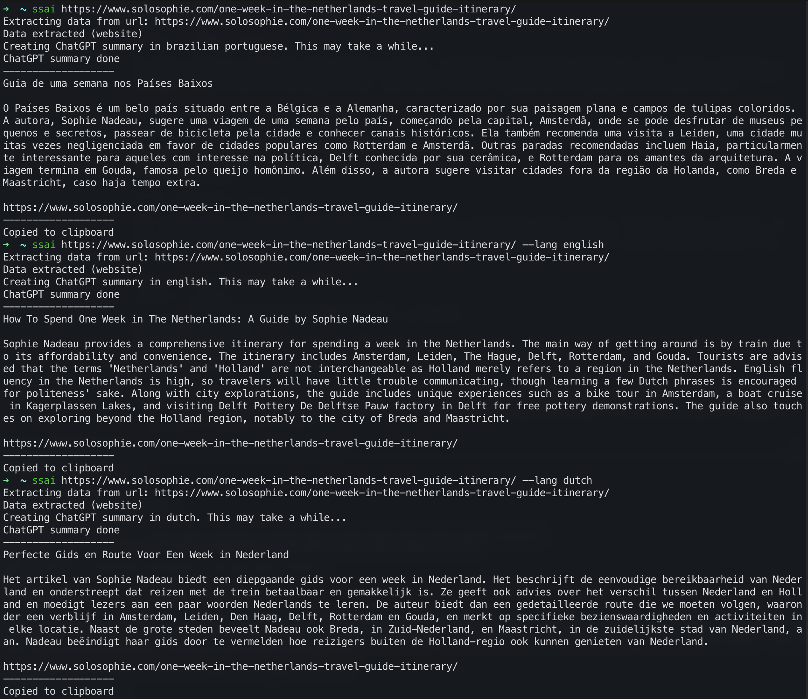

# SuperSummarizeAI

## Description
SuperSummarizeAI is a versatile Python tool designed to extract and summarize textual content. Whether it's from a provided webpage URL, a YouTube video link or a PDF file this tool processes the content through ChatGPT to generate an insightful summary. Once the summary is ready, the tool copies the content directly to your clipboard for quick access and sharing. Additionally, with its multilingual capabilities, SuperSummarizeAI can cater to a global audience, generating summaries in various languages.

## Installation

1. Ensure you have Python 3 installed on your system.
2. Clone the repository to your local machine:
```
git clone https://github.com/alexandrevl/SuperSummarizeAI.git
```
3. Navigate to the cloned directory:
```
cd SuperSummarizeAI
```
4. Install the required packages using pip:
```
pip install requests beautifulsoup4 pyperclip openai python-dotenv youtube_transcript_api argparse PyPDF2
```
5. Create a `.env` file in the root directory of your project. Inside this file, add the following line. Remember to replace `YOUR_OPENAI_KEY` with your actual OpenAI key (You can get one [here](https://beta.openai.com/)):
```
OPENAI_KEY="YOUR_OPENAI_KEY"
```
For security reasons, always ensure that your `.env` file remains confidential. Do not share or expose it as it contains sensitive API credentials.

## Usage
To employ SuperSummarizeAI, simply provide the desired URL (webpage or YouTube video) or PDF file as a command-line argument:

```
python ssai.py <TARGET>
```

For instance:
```
python ssai.py https://example.com
```
or 
```
python ssai.py MY_PDF.pdf
```

For multilingual summaries, specify your desired language using the `--lang` option (default is 'brazilian portuguese'):
```
python ssai.py <TARGET> --lang <desired_language>
```

## 📸 Examples

See SuperSummarizeAI in action:

### Webpage Summarization:


### YouTube Video Summarization:


## Troubleshooting

- **TARGET Input**: Make sure the URL you input is correctly formatted and always begins with `http://` or `https://`. For PDF files, ensure the file is in the same directory as the script or provide the full path to the file.
- **Dependencies**: Double-check to ensure all required dependencies are correctly installed.
- **Command Line Argument**: Always provide a URL when executing the script.
- **OpenAI Key**: Make sure your `.env` file contains the correct and valid OpenAI key.

## Contributing
Interested in contributing to SuperSummarizeAI? We'd love to collaborate! Please initiate by opening an issue to discuss the changes you'd like to make.

## License
Licensed under [MIT](https://choosealicense.com/licenses/mit/).